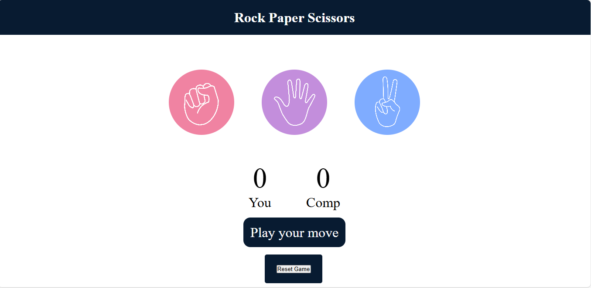
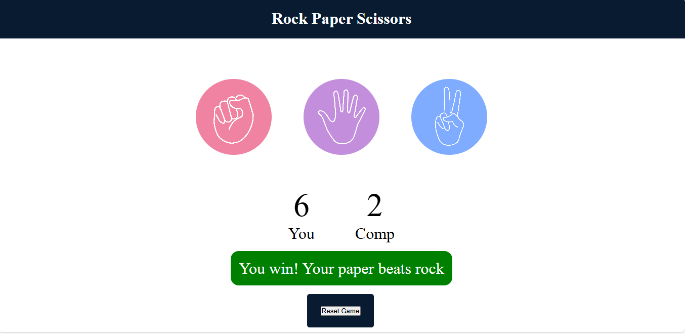
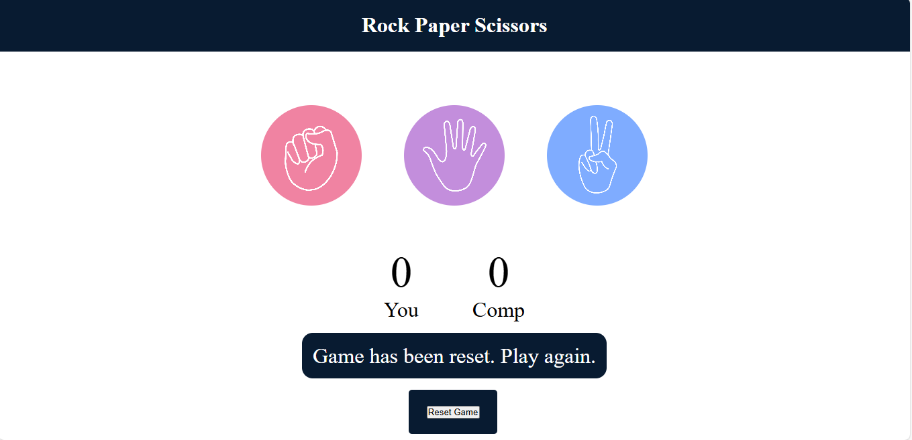

# Web-Development-Recap
# Rock Paper Scissors Game

A simple interactive Rock-Paper-Scissors game built with HTML, CSS, and JavaScript. Play against the computer, see your scores update in real-time, and reset the game as needed.

---

## Features

- Choose between Rock, Paper, or Scissors
- Computer randomly generates its choice
- Displays the winner of each round
- Keeps track of user and computer scores
- Reset button to restart the game

---

## Demo

---

## How to Play

1. Open the `index.html` file in your web browser.
2. Click on one of the options: **Rock**, **Paper**, or **Scissors**.
3. The game will display the result and update scores.
4. Use the **Reset** button to start fresh at any time.

---

## Setup

No setup required! Simply open the `index.html` file in your preferred web browser.

---

## Files

- `index.html` — The main HTML file
- `style.css` — Styles for the game (if you have a separate CSS file)
- `script.js` — JavaScript logic for game functionality

---

## Customization

Feel free to modify the styles, add animations, or enhance the game with new features!

---

## License

This project is for educational purposes. Feel free to use and modify as needed.

---

## Contact

Made with ❤️ by [Waqar Ali](https://www.linkedin.com/in/waqar-ali-b70976322/)
